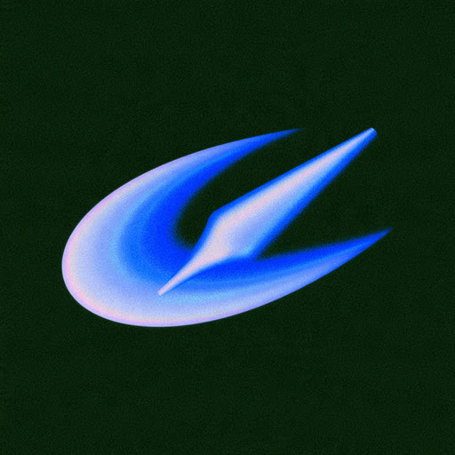

<p align="center"></p>

<h1 align="center">RISE Sketch</h1>

**Your stroke is the seed. Hold still, and it rises.**

RISE Sketch is a drawing instrument where every mark is alive. You draw a stroke, and a growth *Form*
grows it: into coastline, crystal, botany, smoke, feathers, braids, a hand's breadth behind
the nib. There are no sliders. The ink reads your hand instead: speed, pressure, lean, stillness,
zoom and the ink already on the page.

It runs in any modern browser, works offline, and ships as a single HTML file.

## The three primitives

At the bottom of the screen are three chips. **Tap a chip to choose a kind; drag it to bend that
kind's one amount.**

| Chip | Tap to choose | Drag to bend |
|---|---|---|
| **Stroke** | the nib: Pen, Brush, Chisel — or Erase | size |
| **Color** | the ink: Graphite, Indigo, Oxide, Ochre, Moss, Rose, Spectral, plus two recent custom inks; and the ground, Night or Paper | hue (sideways) and tone (up/down) |
| **Form** | what the stroke grows into (below) | base depth |

The sheets show *your own last stroke* drawn through each option, so you can see what you'd get.

### Forms

| Key | Form | What it grows |
|---|---|---|
| 1 | Line | the bare stroke, weathering into coastline as it deepens |
| 2 | Echo | the stroke folds into itself as a crystal; a closed loop becomes a snowflake |
| 3 | Sprout | branching botany; a tap bursts into a bush |
| 4 | Drift | silky smoke pouring off the stroke |
| 5 | Craze | a drying film that cracks into a cellular network |
| 6 | Plume | a feather vane; speed ruffles it, a loop becomes an eye-spot |
| 7 | Caustic | the stroke as a mirror; light folds into caustics at bends |
| 8 | Burin | engraver's hatching on the shadow side |
| 9 | Plait | three strands braiding over and under |
| 0 | Orbit | a rope of looping orbits; a tap draws a spirograph rose |

## How the ink reads your hand

**Speed = wildness · Pressure = weight & opening · Hold = rise · Lean = direction · Zoom = scale · Nearby ink = awareness**

- **Hold still** mid-stroke and the ink *pools*: growth deepens right where you paused. With a pen,
  easing off the pressure during a hold lets it settle back. The first undo drains a pool; the
  second removes the stroke.
- **Tap** to plant a seed; hold before moving to make it bloom.
- **Close a loop** and the ends weld seamlessly.
- **Zoom in** for finer marks — nib size is in screen pixels.
- Rise learns your lightest and heaviest touch, your speed and your hand's tremor, then holds still.

**Night** composites ink as light (overlaps glow); **Paper** composites it as pigment (overlaps
glaze). The same drawing works on both; press `G` to switch.

## Gestures

**Mouse / trackpad:** drag to draw · right-drag to erase · wheel or pinch to zoom (a trackpad scroll
pans) · Space-drag to pan · Ctrl/⌘-click to select, Ctrl/⌘-drag to lasso (Shift adds) ·
Alt/⌥-click to sample a colour from the ink.

**Pen + fingers (tablet):** the pen draws (eraser end or barrel button erases) · one finger pans,
two fingers pan and zoom · tap ink with a finger to select, hold then drag to lasso · two-finger
tap undoes.

**Touch only:** one finger draws · two fingers pan and zoom · two-finger tap undoes · double-tap ink
to select (then drag to lasso) · double-tap the canvas to deselect.

With strokes selected, the chips restyle the selection, and tapping the selection's own Form again
reseeds it.

## Keys

| Key | Action |
|---|---|
| `1`–`9`, `0` | choose a Form |
| `B` / `Shift+B` | next / previous nib |
| `C` / `Shift+C` | next / previous ink |
| `G` | Night / Paper |
| `E` | erase mode |
| `[` `]` | size smaller / larger |
| `-` `=` | depth shallower / deeper |
| `R` | reseed the selection, else the last stroke |
| `Ctrl/⌘+Z`, `Ctrl+Y` / `⇧⌘Z` | undo / redo |
| `Ctrl/⌘+A` · `Del` · `Esc` | select all · delete selection · deselect / close |
| `Shift+1` / `Shift+0` | fit the drawing / 100% |
| `P` | replay the drawing |
| `Ctrl/⌘+S` · `Ctrl/⌘+O` · `Ctrl/⌘+E` | save `.rise` · open · export PNG |
| `?` | gestures and keys |

## Files

- Your drawing **autosaves** in the browser. The menu lists **Recent** drawings; **New** keeps the
  old one in Recent.
- **Save project** downloads a `.rise` file (the drawing as recipes, so it reopens exactly);
  open it from the menu or drop it on the canvas.
- **Export image** saves a high-resolution PNG framed to your drawing.
- **Replay** redraws the whole drawing, stroke by stroke, as it was made.

## Building and running

Requires Node 20.19+ or 22.12+.

```sh
npm install
npm run dev            # development server
npm run build:single   # dist-single/index.html: one self-contained file, opens by double-click
npm run build          # regular multi-file build in dist/
```

Checks: `npm run typecheck` · `npx vitest run` (unit tests) ·
`npm run build:single && node scripts/e2e.mjs` (end-to-end in headless Chrome; set `CHROME_PATH`
if Chrome isn't in the default location).

## For contributors

- `docs/DESIGN.md` — the product and technical specification.
- `docs/BUILD.md` — module ownership and the contracts between modules.
- `lab/forms/` — the forms lab, where new Forms are prototyped against the real pipeline
  (see `lab/forms/README.md`).
- `procedural-ink.html` — the original single-file demo Rise grew from.
